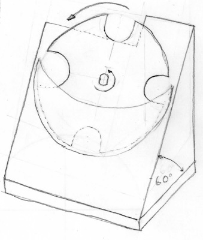
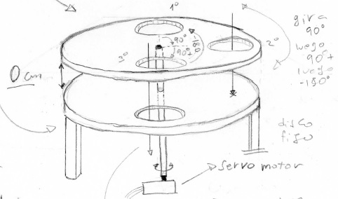
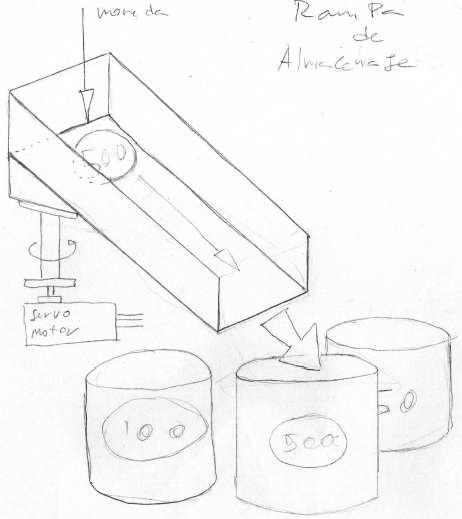

# ClasificadorObsoleitor

## Acerca del proyecto

Un clasificador automático de monedas chilenas usando una red neuronal multicapa. Este proyecto fue realizado en el contexto de una asignatura para la universidad con el objetivo de aprender de manera práctica sobre inteligencia computacional. Este trabajo se basa en un paper de Khashman et. al. (ver referencias) y utiliza un perceptrón multicapa como motor del sistema inteligente.

ADVERTENCIA: Esta tecnología es obsoleta. Cualquier cosa que requiera procesamiento de imágenes puede ser resuelto con mucho mejores resultados usando redes convoucionales y una pléyade de otras redes especializadas que han emergido a lo largo de los años. Otro punto para huir es el desorden y la mala documentación del código. Es muy poco probable que vuelva a visitar este proyecto y lo mejore.

## El hardware

### Estructura mecánica
Usando la vieja y confiable fuente de inspiración (plagio) de Youtube, se copia un mecanismo para extraer de a una las monedas desde un recipiente. Como primera aproximación se prototipa con cartón. Esto es lo que se denomina la etapa 1. A continuación esta la etapa 2 que consiste en dos discos concéntricos que permite posicionar la moneda frente a la cámara. Por último se tiene la tercera etapa que consiste en un rampa orientable.

### Electrónica

+ Raspberry Pi 3
+ Arduino Uno
+ Módulo Cámara Raspberry Pi v2

### Extras

+ Micro servos 9g
+ Mucho cartón
+ Silicona caliente
+ cables, conectores y similares
+ fuente de poder

## El software

El código que corre en el RaspberryPi 3 es escrito en python y utiliza las librerías de *scikit-learn* y *opencv* y se encarga de la inteligencia y la operación en alto nivel. Por otro lado, el arduino se encarga de la operación de bajo nivel de los motores. Lamentablemente el código para arduino se extrvió.

### El algoritmo

Lo que se hace para clasificar es escencialmente replicar la metodología del paper de Khashnan et. al. Par obtener las imágenes tal como se usan el el paper se acondicionan las imágenes usando la librería *opencv*. En resumen los pasos usados son.

1. Detección de bordes por medio de *Canny*
2. Encuadre y recorte de imágen usando *la transformada de Hough*
3. Clasificación por medio de red neuronal multicapa

# Enlaces y referencias

## Videos
[Primera etapa funcionando](https://youtu.be/b-e9ZDQvpNs)
[Segunda y tercera etapa funcionando conjuntamente](https://youtu.be/b-e9ZDQvpNs)
[Prueba final](https://youtu.be/b-e9ZDQvpNs)

# Referencias
[Librería scikit-learn](https://scikit-learn.org/stable/index.html)
[Coin Identification Using Neural Networks - Adnan Khashman, Boran Sekeroglu, Kamil Dimililer](https://pdfs.semanticscholar.org/c872/97c158b1e0d4af8889a25e6a06d6305134d1.pdf) 
